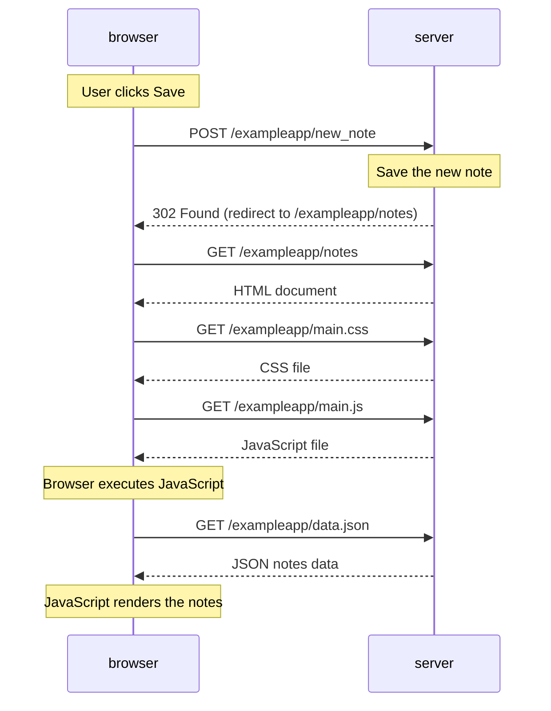

# Exercise 0.4 - New Note

Sequence diagram showing what happens when a user creates a new note in the traditional Notes application.

```mermaid
sequenceDiagram
    participant browser
    participant server

    Note over browser: User clicks Save

    browser->>server: POST /exampleapp/new_note
    Note over server: Save the new note
    server-->>browser: 302 Found (redirect to /exampleapp/notes)

    browser->>server: GET /exampleapp/notes
    server-->>browser: HTML document

    browser->>server: GET /exampleapp/main.css
    server-->>browser: CSS file

    browser->>server: GET /exampleapp/main.js
    server-->>browser: JavaScript file

    Note over browser: Browser executes JavaScript

    browser->>server: GET /exampleapp/data.json
    server-->>browser: JSON notes data

    Note over browser: JavaScript renders the notes
```
