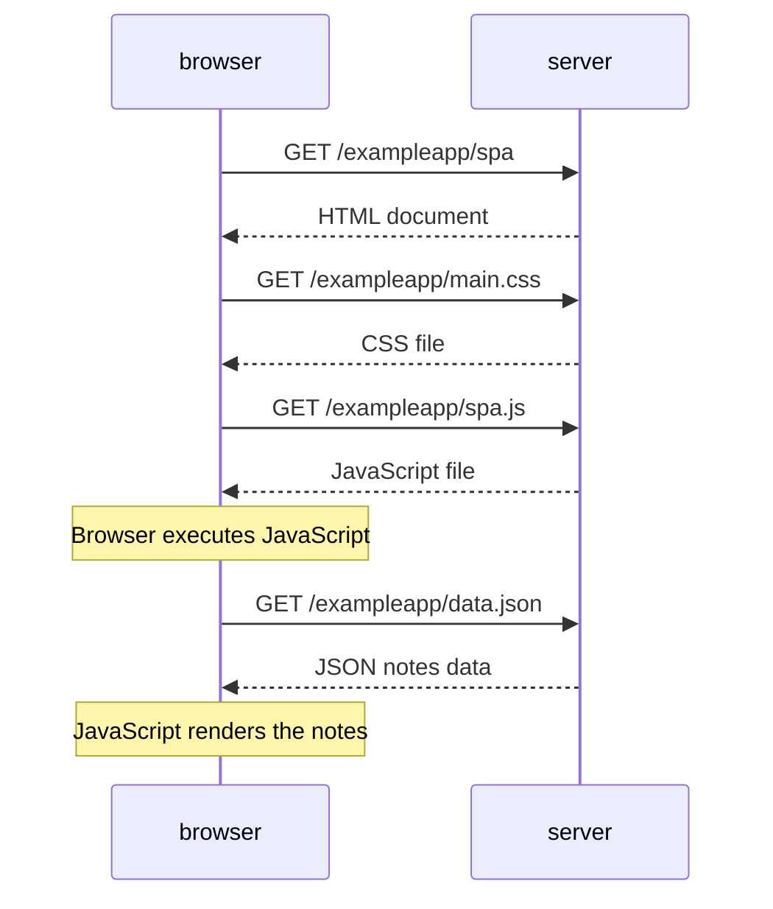

# Exercise 0.5 - Single Page App

Sequence diagram showing how the browser loads the SPA Notes application.

```mermaid
sequenceDiagram
    participant browser
    participant server

    browser->>server: GET /exampleapp/spa
    server-->>browser: HTML document

    browser->>server: GET /exampleapp/main.css
    server-->>browser: CSS file

    browser->>server: GET /exampleapp/spa.js
    server-->>browser: JavaScript file

    Note over browser: Browser executes JavaScript

    browser->>server: GET /exampleapp/data.json
    server-->>browser: JSON notes data

    Note over browser: JavaScript renders the notes
```
