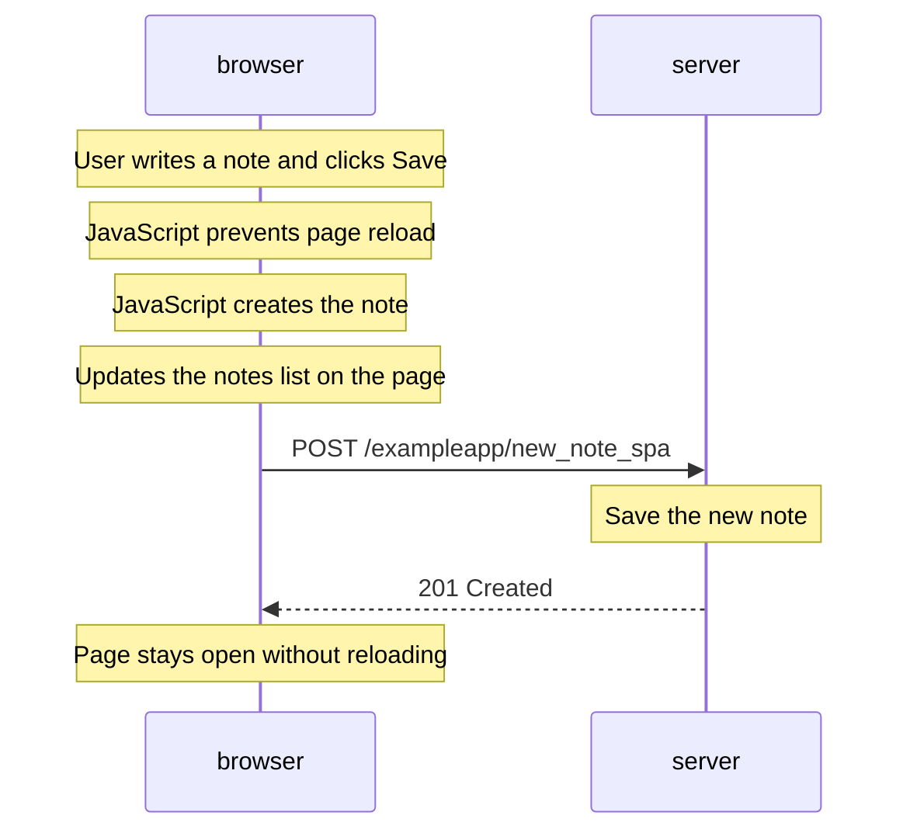

# Exercise 0.6 - New Note in SPA

Sequence diagram showing what happens when a user creates a new note in the Single Page Application.

```mermaid
sequenceDiagram
    participant browser
    participant server

    Note over browser: User writes a note and clicks Save
    Note over browser: JavaScript prevents page reload
    Note over browser: JavaScript creates the note
    Note over browser: Updates the notes list on the page

    browser->>server: POST /exampleapp/new_note_spa
    Note over server: Save the new note
    server-->>browser: 201 Created

    Note over browser: Page stays open without reloading
```
